# Project Report

Author: Rebecca Knezy, Derek Marshall, Joanne Bui

Date: April 10, 2021

Github Link: https://github.com/DerekMarshall855/MyDynamicScheduler

## P2.1 Client Side Component & UI

{width=600px}
 
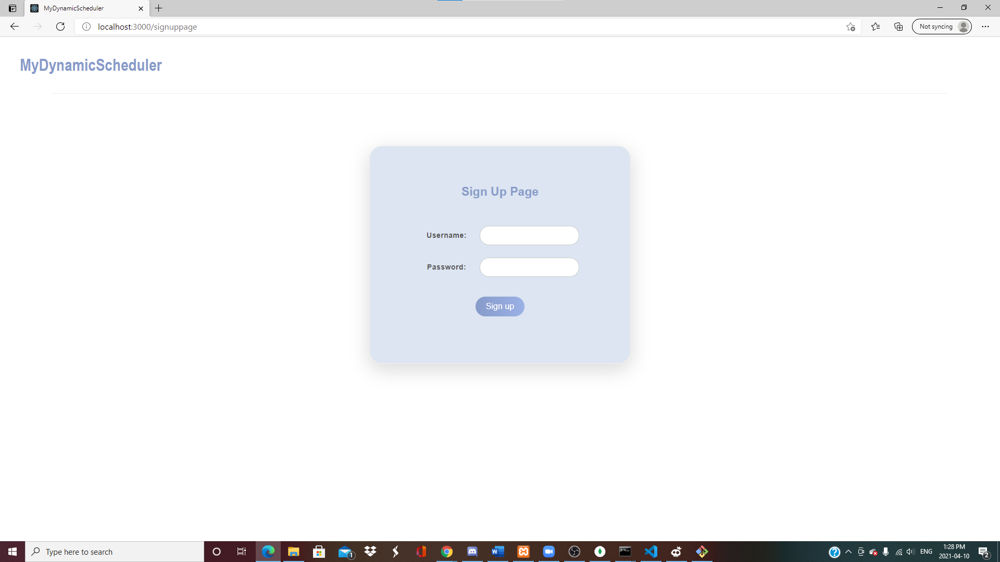{width=600px}

{width=600px}

{width=600px}

{width=600px}

{width=600px}

{width=600px}

## P2.2 Server side CGI components

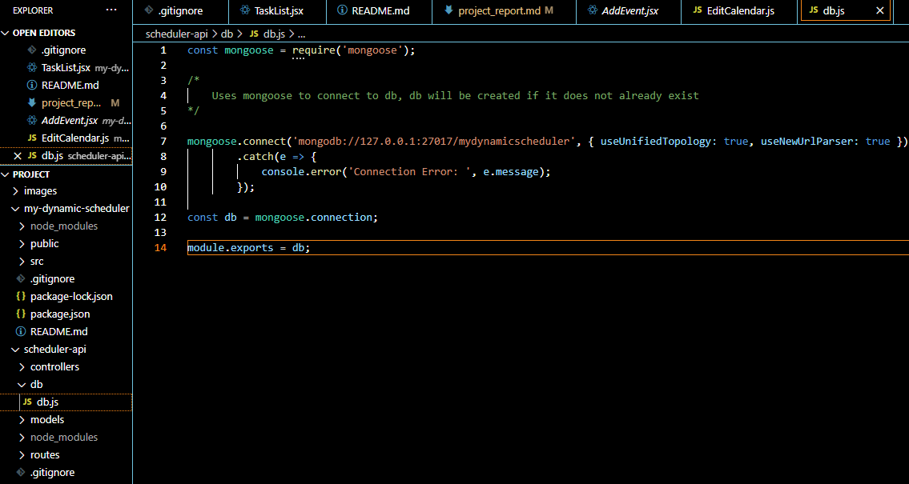{width=75%}

{width=75%}

{width=600px}

{width=600px}

{width=600px}

{width=600px}

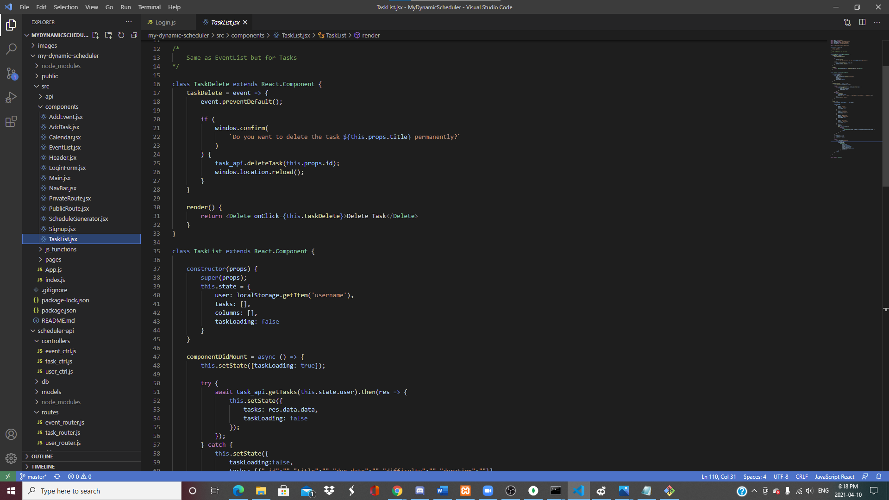{width=600px}

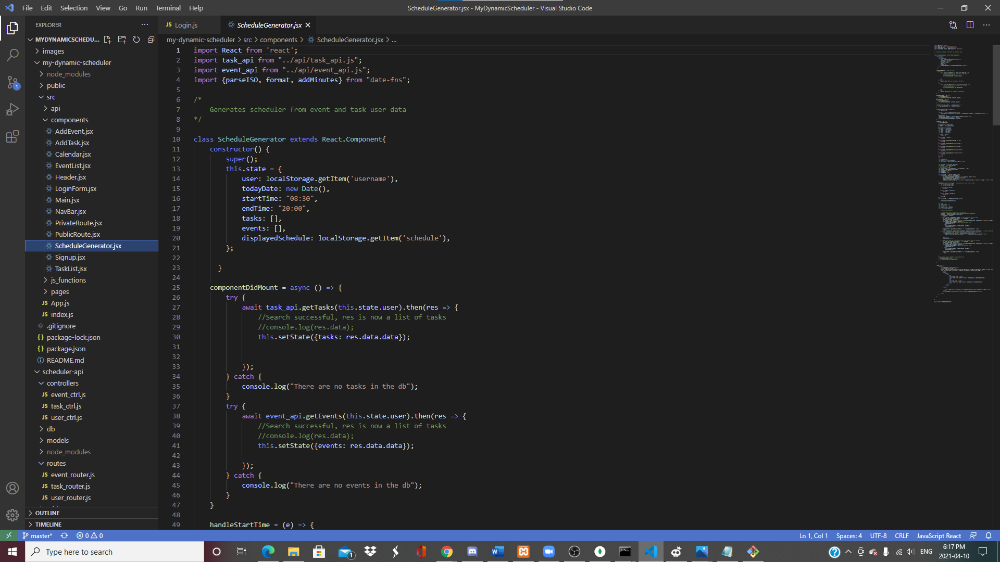{width=600px}

{width=600px}

{width=600px}

## P2.3 Database Tier Design, Data, Usage
{width=600px}

Additionally if the user does not have this db or collections created already,
mongodb creates them automatically. Mongoose Schema (shown later) defines the exact
layout for data in each collection

### Collections in mydynamicscheduler

{width=600px}

To save accounts when users make an account through the sign up page.

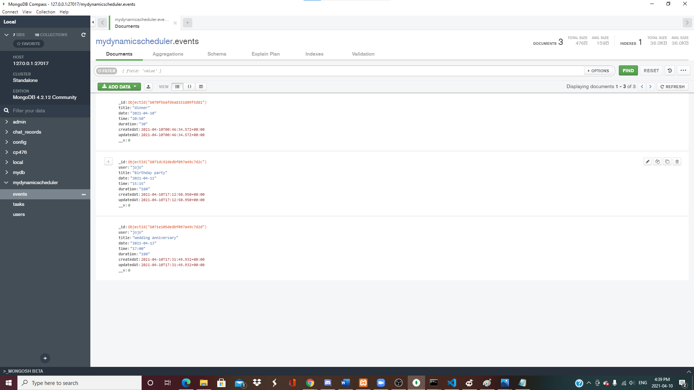{width=600px}

To save events when users add an event through the form in "Calendar" page. 

{width=600px}

To save events when users add a task through the form in "Calendar" page.

Accessed when creating the monthly calendars. If there is an event or task, it will be shown in the corresponding cell on the calendar. The schedule generator also retrieves tasks from the collection for certain days.

## P2.4 New Features and Tools
When signing up, we use the SHA-1 hash function to encrypt passwords before saving them into the database. 

For logins, the user and password have to be authenticated before the user is granted access. When the information does not match what is in the users collection, a message will appear. 

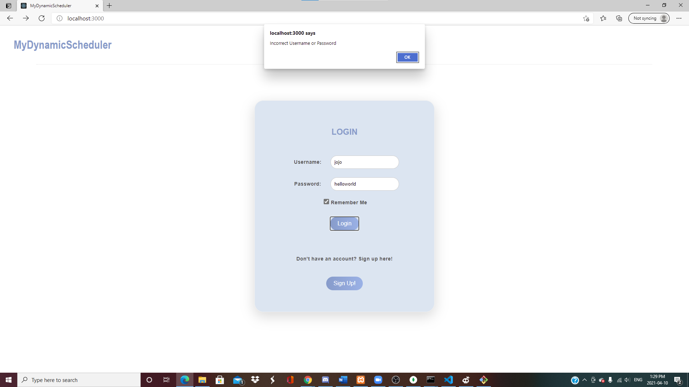{width=600px}

In the Calendar page, users can add a task or event by filling out the form.

When editing tasks and events, the chosen one will be retrieved from events/tasks collection and removed from the database.

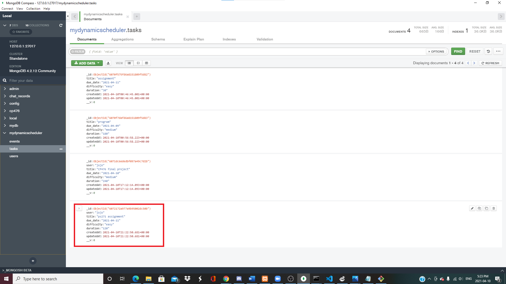{width=600px}

{width=600px}

{width=600px}

Scheduling algorithm retrieves tasks from the database for the day and sorts them according to due date and difficulty.

{width=600px}

## P2.5 Problem Solving Algorithms
During Signup, authentication is needed to make sure there will not be any accounts with the same username

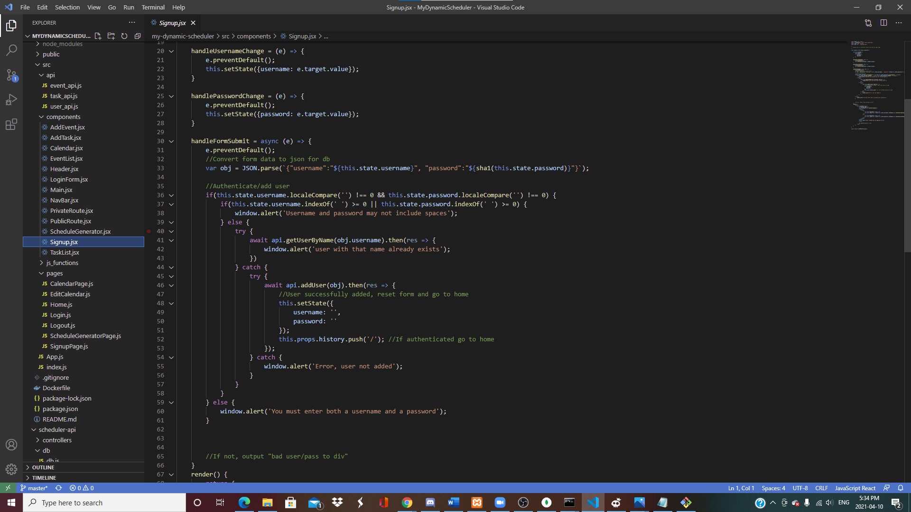{width=600px}

Login Authentication that was discussed in the section above.

{width=600px}

Scheduling algorithm to organize users' tasks for the day. The algorithm will take in what time the user wants to start and stop doing work.

Authentication ensures that if the user is not logged in they cannot access private routes (calendar, edit, logout, home, generate schedule) and if they are logged in they
can no longer access public routes (login, signup). We use RouteRedirect to redirect the user.

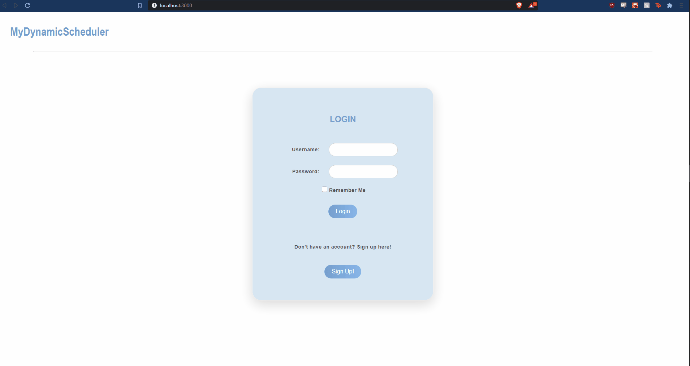

We created a day checker helper function to tell if a day had any events/tasks

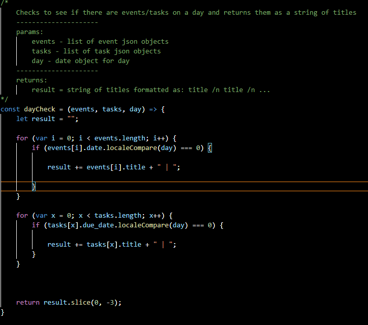{width=75%}

We used Mongoose and Axios to access our database easily and make changes efficiently. Below are images of the libraries in use (user example).
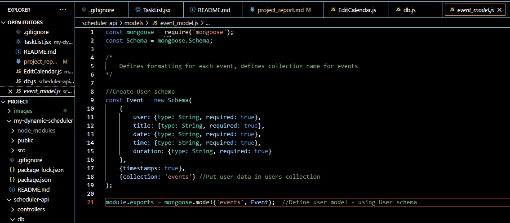{width=75%}
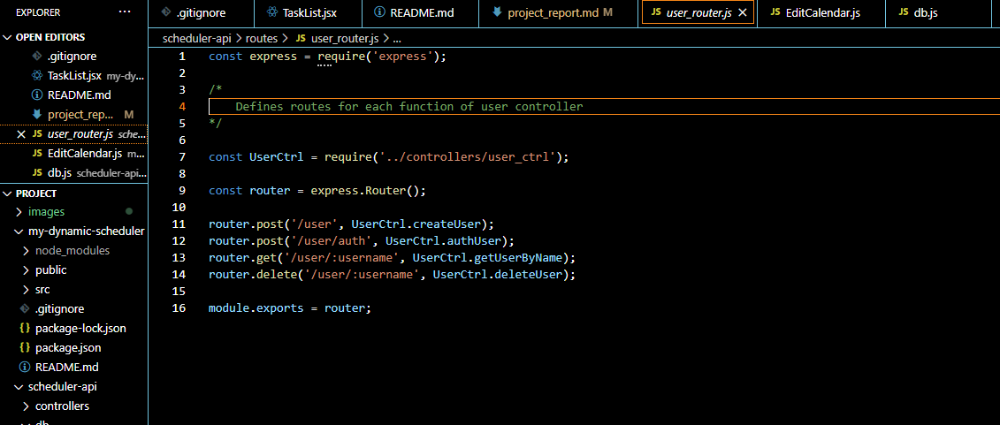{width=75%}
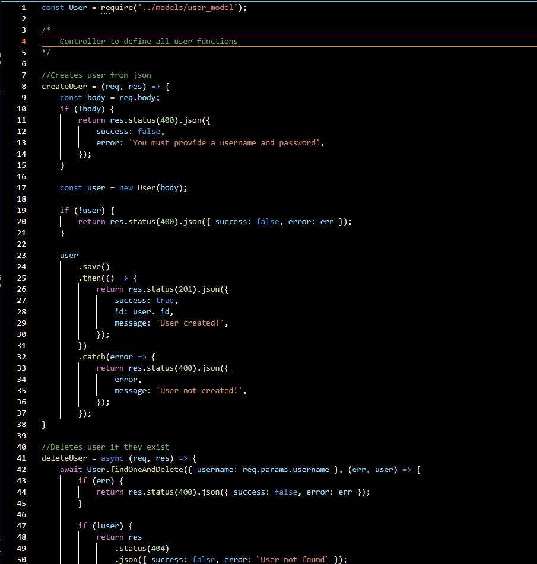{width=75%}
{width=75%}

## P2.6 Robustness and Efficiency

Our code has been thoroughly tested and allows for quick functionality with no known errors.

As seen in the above gifs the site is efficient, quickly updating the users information, rerouting and generating the schedule.

Task, event and schedule information are also specific to a users account.

We use a simple login controller util function to keep track of the users current state in local storage

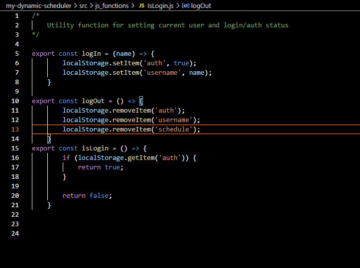{width=75%}