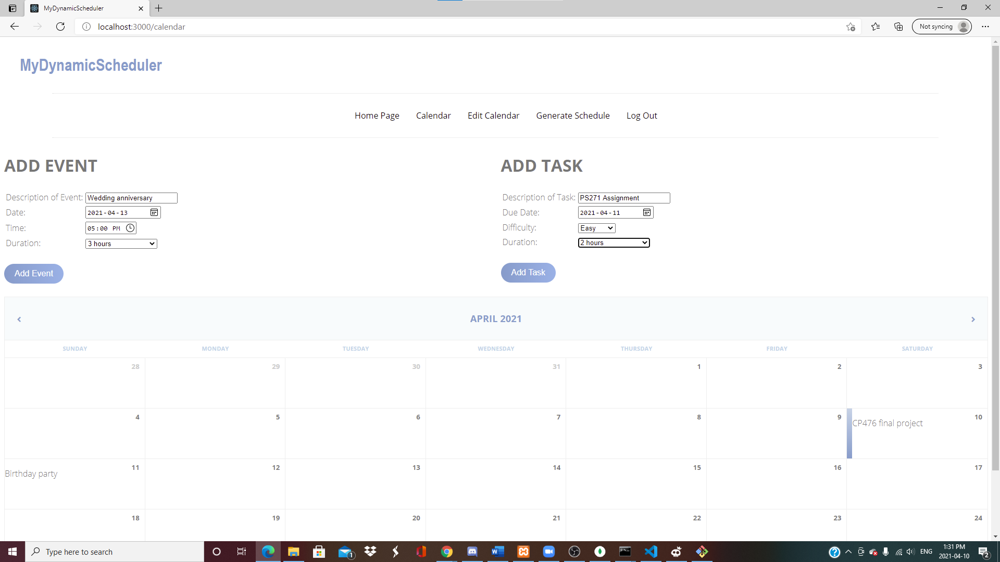
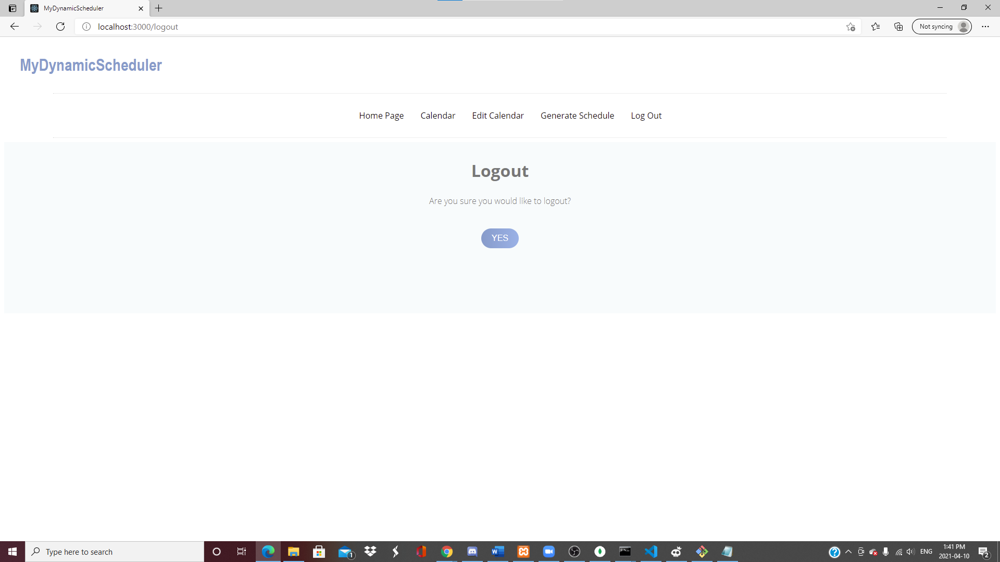
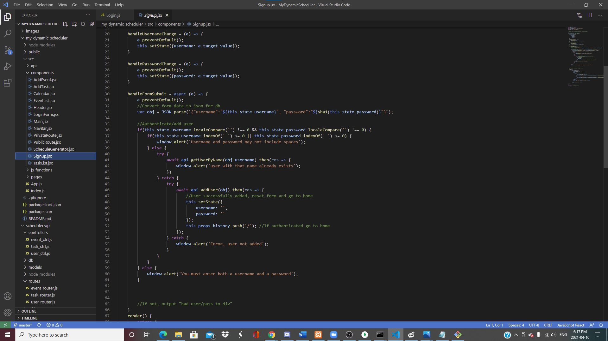
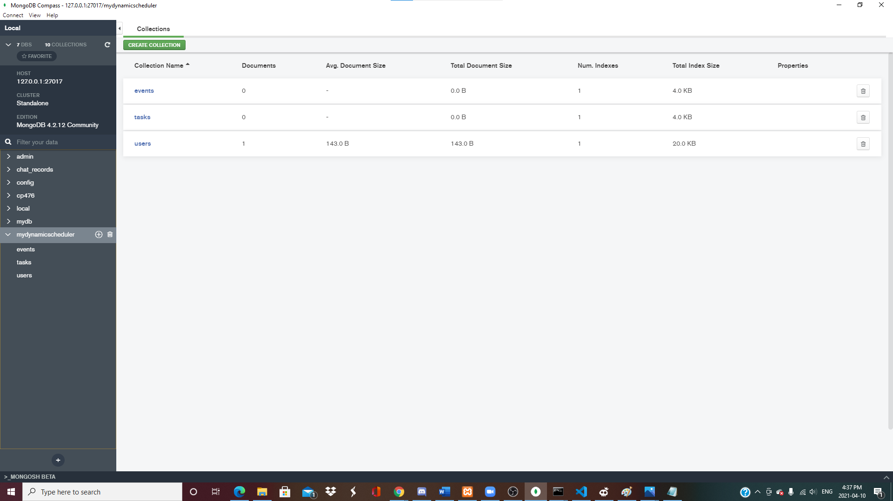
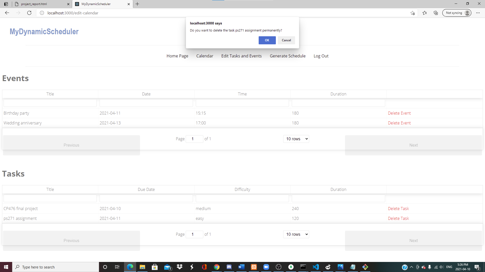

# Project Report

Author: Rebecca Knezy, Derek Marshall, Joanne Bui

Date: April 10, 2021

## P2.1 Client Side Component & UI

{width=600px}
 
{width=600px}

{width=600px}

{width=600px}

{width=600px}

{width=600px}

{width=600px}

## P2.2 Server side CGI components

{width=600px}

{width=600px}

{width=600px}

{width=600px}

{width=600px}

{width=600px}

{width=600px}

{width=600px}

## P2.3 Database Tier Design, Data, Usage
{width=600px}

### Collections in mydynamicscheduler

{width=600px}

To save accounts when users make an account through the sign up page.

{width=600px}

To save events when users add an event through the form in "Calendar" page. 

{width=600px}

To save events when users add a task through the form in "Calendar" page.

Accessed when creating the monthly calendars. If there is an event or task, it will be shown in the corresponding cell on the calendar. The schedule generator also retrieves tasks from the collection for certain days.

## P2.4 New Features and Tools
When signing up, we use the SHA-1 hash function to encrypt passwords before saving them into the database. 

For logins, the user and password have to be authenticated before the user is granted access. When the information does not match what is in the users collection, a message will appear. 

{width=600px}

In the Calendar page, users can add a task or event by filling out the form.

When editing tasks and events, the chosen one will be retrieved from events/tasks collection and removed from the database.

{width=600px}

{width=600px}

{width=600px}

Scheduling algorithm retrieves tasks from the database for the day and sorts them according to difficulty and duration.

{width=600px}

## P2.5 Problem Solving Algorithms
During Signup, authentication is needed to make sure there will not be any accounts with the same username

{width=600px}

Login Authentication that was discussed in the section above.

{width=600px}

Scheduling algorithm to organize users' tasks for the day. Refer to ScheduleGenerator.jsx. The algorithm will take in what time the user wants to start and stop doing work. 

## P2.6 Robustness and Efficiency
We used Mongoose and Axios to access our database easily and make changes efficiently.

{width=600px}

The user can check the "Remember Me" box so their account details will be saved for the day and they will not have to sign in repeatedly.

 

**References**

1. [HBF, CP476 Assignment 5](a5.html)
2. Add your references used in developing your solutions. 
